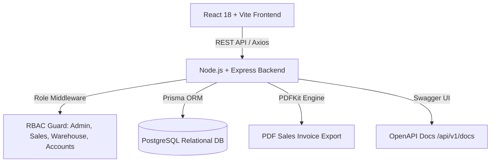

# Mini ERP + CRM Operations Portal

Production-ready Full Stack Enterprise Monorepo designed for wholesale and distribution companies managing **Customers (CRM)**, **Products Catalog**, **Warehouse Inventory Stock Movements**, and **Sales Delivery Challans** with strict **Role-Based Access Control (RBAC)**.

---

## 🌐 Live Production Application Links

- 💻 **Live Frontend Portal**: [https://minierp-frontend.onrender.com](https://minierp-frontend.onrender.com)
- ⚙️ **Live Backend API**: [https://minierp-backend-w2xc.onrender.com/api/v1](https://minierp-backend-w2xc.onrender.com/api/v1)
- 📚 **Live Swagger OpenAPI Docs**: [https://minierp-backend-w2xc.onrender.com/api/v1/docs](https://minierp-backend-w2xc.onrender.com/api/v1/docs)

---

## 🏗 Architecture Diagram



---

## 🚀 Tech Stack

### Backend
- **Runtime & Framework**: Node.js, TypeScript, Express.js
- **Database & ORM**: PostgreSQL, Prisma ORM
- **Authentication**: JWT, bcrypt
- **Validation**: Zod
- **Logger**: Winston
- **Documentation**: Swagger OpenAPI (`/api/v1/docs`)
- **PDF Export**: PDFKit

### Frontend
- **Framework**: React 18, Vite, TypeScript
- **Routing**: React Router DOM v6
- **State & Data Fetching**: TanStack Query (React Query v5), Axios
- **Forms & Validation**: React Hook Form, Zod
- **Styling & UI**: TailwindCSS, Glassmorphism design system, Lucide icons, Dark/Light Mode

### DevOps & Deployment
- **Containerization**: Docker, Docker Compose
- **CI/CD**: GitHub Actions
- **Deployment Blueprint**: Render.yaml

---

## 🔑 Pre-Seeded Test Credentials

| Role | Email | Password | Allowed Access / Permissions |
| :--- | :--- | :--- | :--- |
| **Admin** | `admin@minierp.com` | `Password123!` | Full system access across all modules, user deletion, stock management |
| **Sales** | `sales1@minierp.com` | `Password123!` | Customers CRM, Customer Notes, Create/Edit Sales Challans |
| **Warehouse**| `warehouse1@minierp.com` | `Password123!` | Product Catalog, Manual Stock Adjustments (IN/OUT), Inventory Logs |
| **Accounts** | `accounts1@minierp.com` | `Password123!` | View Customers, Products, View Challans, Export PDF Invoices |

> **Note**: Seed script populates **1 Admin, 2 Sales, 2 Warehouse, 2 Accounts users, 20 Customers, 50 Products, 100 Stock Movements, and 15 Sales Challans**.

---

## 🛠 Setup & Deployment Instructions

### Prerequisites
- Node.js >= v20
- PostgreSQL database (or Docker Compose)
- npm or yarn

### 1. Running with Docker Compose (Easiest)

```bash
# Clone repository and launch all services
docker-compose up --build -d
```
The application will be accessible at:
- **Frontend UI**: `http://localhost` (or `http://localhost:5173`)
- **Backend REST API**: `http://localhost:5000/api/v1`
- **Swagger Documentation**: `http://localhost:5000/api/v1/docs`

---

### 2. Manual Local Setup (Without Docker)

#### Step 1: Database Setup & Backend Initialization
```bash
cd backend

# Install dependencies
npm install

# Setup Environment Variables
cp .env.example .env

# Run Prisma Database Migrations
npx prisma migrate dev --name init

# Seed Database with Test Accounts & Data
npx prisma db seed

# Start Backend Dev Server
npm run dev
```

#### Step 2: Frontend Initialization
```bash
cd ../frontend

# Install dependencies
npm install

# Start Vite Development Server
npm run dev
```

---

### 3. Render Cloud Deployment (Production Infrastructure)

This repository includes a pre-configured [render.yaml](file:///c:/Users/user/.gemini/antigravity-ide/scratch/mini-erp-crm/render.yaml) Infrastructure-as-Code Blueprint for one-click deployment to Render's free tier.

1. **Push repository to GitHub**:
   ```bash
   git add .
   git commit -m "Prepare for Render cloud deployment"
   git push origin main
   ```

2. **Deploy via Render Blueprint**:
   - Go to [Render Dashboard](https://dashboard.render.com).
   - Click **New +** → **Blueprint**.
   - Connect your GitHub repository (`mini-erp-crm`).
   - Click **Apply**.

Render automatically provisions and deploys:
- 🗄️ **PostgreSQL Database** (`minierp-db`): Free Tier database instance.
- ⚙️ **Backend Web Service** (`minierp-backend`): Automatic Prisma schema push, data seeding, and Express REST API server execution.
- 💻 **Frontend Static Site** (`minierp-frontend`): Built Vite React app served globally with automatic rewrite rules for single-page routing (`SPA`).

---

## 📋 REST API Reference Table

| Method | Endpoint | Allowed Roles | Description |
| :--- | :--- | :--- | :--- |
| **POST** | `/api/v1/auth/login` | Public | JWT Authentication login |
| **GET** | `/api/v1/auth/me` | Authenticated | Get currently logged-in user profile |
| **GET** | `/api/v1/customers` | Admin, Sales, Accounts | Search, filter, and paginate customer list |
| **GET** | `/api/v1/customers/:id` | Admin, Sales, Accounts | Customer detail, CRM notes history & order history |
| **POST** | `/api/v1/customers` | Admin, Sales | Register new wholesale customer |
| **PUT** | `/api/v1/customers/:id` | Admin, Sales | Update customer details |
| **DELETE**| `/api/v1/customers/:id` | Admin | Delete customer record |
| **POST** | `/api/v1/customers/:id/notes` | Admin, Sales | Add CRM follow-up note |
| **GET** | `/api/v1/products` | All Roles | Search, filter category/low-stock, paginated list |
| **GET** | `/api/v1/products/:id` | All Roles | Product details & movement history |
| **POST** | `/api/v1/products` | Admin, Warehouse | Add new product to catalog |
| **PUT** | `/api/v1/products/:id` | Admin, Warehouse | Edit product definition |
| **DELETE**| `/api/v1/products/:id` | Admin | Delete product |
| **POST** | `/api/v1/products/:id/stock` | Admin, Warehouse | Adjust stock manually (`IN` / `OUT`) |
| **GET** | `/api/v1/stock-movements` | Admin, Warehouse | Search and filter stock movement audit log |
| **GET** | `/api/v1/challans` | All Roles | List Sales Challans with status filters |
| **GET** | `/api/v1/challans/:id` | All Roles | Detailed view of Sales Challan with snapshots |
| **POST** | `/api/v1/challans` | Admin, Sales | Create Sales Challan (Draft or Confirmed) |
| **PATCH**| `/api/v1/challans/:id/status` | All Roles | Update status (`DRAFT` -> `CONFIRMED` or `CANCELLED`) |
| **GET** | `/api/v1/challans/:id/pdf` | All Roles | Export/Download PDF Sales Invoice |
| **GET** | `/api/v1/dashboard/metrics` | All Roles | Fetch dashboard KPIs and recent activity log |

---

## 🛡 Business Logic & Transaction Rules

1. **Sales Challan Stock Reduction**:
   - **Draft Status**: No inventory stock reduction occurs. Allows editing and draft saving.
   - **Confirmed Status**: Atomically executes Prisma `$transaction` that verifies sufficient `currentStock` for all line items. If stock is insufficient, throws `400 Bad Request`. If sufficient, reduces stock on `Product` table and records an `OUT` `StockMovement`.
   - **Cancelled Status**: Restocks inventory by incrementing `currentStock` and logging an `IN` `StockMovement`.
2. **Product Snapshots**:
   - Each `SalesChallanItem` stores immutable JSON product snapshots (`name`, `sku`, `category`) and price snapshot (`priceSnapshot`). Future product price edits do not retroactively alter historical invoices.

---

## 📁 Repository Directory Structure

```
mini-erp-crm/
├── backend/
│   ├── prisma/
│   │   ├── schema.prisma
│   │   └── seed.ts
│   ├── src/
│   │   ├── config/          # Env, Logger, Prisma, Swagger
│   │   ├── controllers/     # Auth, Customer, Product, Stock, Challan, Dashboard
│   │   ├── middlewares/     # Auth, Role RBAC, Validate, Error
│   │   ├── repositories/    # Database Repository Layer
│   │   ├── routes/          # Express API Endpoints
│   │   ├── services/        # Core Business Logic & Transactions
│   │   ├── utils/           # JWT, Bcrypt, PDF Generator, Pagination
│   │   ├── validators/      # Zod Request Schemas
│   │   ├── app.ts
│   │   └── server.ts
│   ├── Dockerfile
│   └── package.json
├── frontend/
│   ├── src/
│   │   ├── components/      # UI, Layout, Common Components
│   │   ├── context/         # AuthContext & ThemeContext
│   │   ├── pages/           # Dashboard, Customers, Products, Challans, Inventory
│   │   ├── services/        # Axios API Connectors
│   │   ├── types/           # TypeScript Types
│   │   ├── utils/           # Formatters & PDF Helpers
│   │   ├── App.tsx
│   │   └── main.tsx
│   ├── Dockerfile
│   ├── nginx.conf
│   └── package.json
├── .github/workflows/ci.yml # GitHub Actions Pipeline
├── docker-compose.yml
├── render.yaml
└── README.md
```

---

## 🎯 Assumptions & Design Choices

1. **Monorepo Architecture**: Clean separation between `backend/` and `frontend/` allowing independent Docker containerization.
2. **ACID Transaction Guarantee**: Database transactions ensure inventory never drops below zero even under concurrent requests.
3. **Responsive Dark Mode UI**: Full dark/light mode toggle with Tailwind glassmorphism cards and accessible typography.
